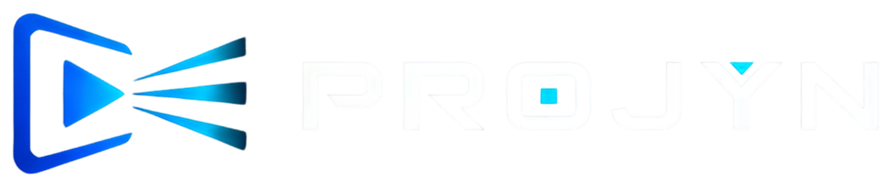

<div align="center">

  <picture>
    <source media="(prefers-color-scheme: dark)" srcset="frontend/public/logo-projyn-clara.png">
    <source media="(prefers-color-scheme: light)" srcset="frontend/public/logo-projyn-escura.png">
    
  </picture>

<p align="center">
    <strong>[Recursos](HTTPS://projyn.kodria.com.br)</strong>
  </p>

  <p align="center">
    <strong>Sistema Profissional de Playout & Biblioteca YouTube para Igrejas, Eventos e Transmissões</strong>
  </p>

  [](https://fastapi.tiangolo.com)
  [](https://react.dev)
  [](https://www.typescriptlang.org/)
  [](https://vitejs.dev/)
  [](https://sqlite.org)
  [](https://github.com/yt-dlp/yt-dlp)
  [](LICENSE)

  <br>

  Organize bibliotecas de vídeos do YouTube por categorias, reproduza transmissões diretas sem anúncios em Full HD/4K e controle o telão/projetor remotamente de qualquer dispositivo.

  <br><br>

  [Recursos](#-recursos-principais) • [Arquitetura](#-arquitetura) • [Como Rodar](#-como-rodar-o-projeto) • [Controle de Acesso](#-permissões-e-segurança) • [Produção & Deploy](#-deploy--produção)

</div>

---

## 🌟 Recursos Principais

### 📺 Playout Kiosk & Multi-Monitores
- **Apresentação em 1 Clique**: Clique em qualquer música ou card para disparar imediatamente no telão do projetor.
- **Detecção Automática de Monitores**: Identifica telas secundárias e saídas HDMI conectadas no Windows.
- **Modo Kiosk Nativo**: Abre o telão em tela cheia sem bordas ou barras de navegador com suporte a perfis isolados.
- **Comandos Remotos em Tempo Real**: Abra, feche, traga para frente (`topmost`) ou minimize o projetor remotamente a partir do painel de controle.
- **Presets de Resolução**: Alterne resoluções com 1 clique (Full HD 1080p, 720p, Janela) ou salve presets personalizados.

### 🎵 Biblioteca & Streaming Direto Sem Anúncios
- **Extração com `yt-dlp`**: Extrai os streams de áudio/vídeo diretos dos servidores do YouTube (`googlevideo.com`), eliminando qualquer anúncio ou interrupção.
- **Busca Integrada do YouTube**: Pesquise títulos e artistas diretamente dentro do app sem precisar abrir o YouTube.
- **Categorias Coloridas**: Crie pastas com cores personalizadas (ex: *Louvores*, *Abertura*, *Vídeos Especiais*).
- **Navegação Alfabética Rápida (A-Z)**: Índice lateral alfabético para saltar instantaneamente para a letra desejada.
- **Menu de 3 Pontos (`...`) e Modais In-App**: Exclua músicas e categorias com confirmações visuais elegantes na própria tela (sem pop-ups nativos cinzas do navegador).
- **Auto-renovação de Links (2 Horas)**: Worker em segundo plano revalida automaticamente todos os links da biblioteca a cada 2 horas com temporizador visual regressivo.

### 🎛️ Painel do Operador (Player)
- **Timeline & Seek Preciso**: Arraste a barra de progresso para avançar ou retroceder a reprodução no telão com sincronização milimétrica.
- **Mixagem de Volume & Mudo**: Controle o ganho sonoro ou silencie a saída instantaneamente.
- **Playlist Rápida Integrada**: Troque de categoria e selecione a próxima música sem sair da tela do operador.
- **Indicador de Status do Projetor**: Visualizador de status (Verde = Telão Aberto / Cinza = Desativado).

### 📱 Experiência Mobile & Responsividade Extrema
- **Navegação Otimizada para Celular**: Menu drawer lateral direito, navbar compacto padronizado (56px) e barra de busca empilhada.
- **Abas Suspensas Fixas**: Navegação de abas de configuração com efeito *frosted glass* fixo sob o navbar.
- **Rolagem Interna Isolada**: Listas com rolagem independente que mantém a barra de busca e o índice A-Z sempre visíveis.

### ⚡ Performance Extrema & Otimização de Domínio
- **Carregamento Instantâneo (0ms)**: Cache de sessão para renderização imediata de bibliotecas, categorias e configurações.
- **Consultas Rápidas no Backend**: Otimizado via `selectinload` no SQLAlchemy para carregar centenas de vídeos em ~10ms.
- **Compressão GZIP & Cache Imutável**: Respostas da API e pacotes web compactados em até 90% via `GZipMiddleware` e `Cache-Control: immutable`.
- **Divisão em Chunks (Code Splitting)**: Carregamento assíncrono modular no Vite.

### 🧭 Tutorial Interativo (Tour Guide)
- Sistema integrado de Spotlight Tour passo a passo em todas as telas (**Biblioteca**, **Player** e **Configurações**).

---

## 🏗️ Arquitetura

O sistema é construído como uma aplicação desacoplada moderna:

```
Projyn/
├── backend/                  # API FastAPI (Python 3.10+)
│   ├── main.py               # Endpoints REST, WebSockets & Middleware
│   ├── database.py           # Modelos SQLAlchemy & Conexão SQLite
│   ├── auth.py               # Autenticação JWT & Criptografia bcrypt
│   └── youtube.py            # Integração com yt-dlp & ytmusicapi
├── frontend/                 # SPA React + TypeScript (Vite)
│   ├── src/
│   │   ├── pages/
│   │   │   ├── Library.tsx   # Biblioteca de vídeos e categorias
│   │   │   ├── Player.tsx    # Controle de playout do operador
│   │   │   ├── Display.tsx   # Telão / Projetor Kiosk
│   │   │   └── Config.tsx    # Painel de configurações do sistema
│   │   ├── components/       # TourGuide, Modais, Botões
│   │   ├── types.ts          # Interfaces TypeScript & Helpers
│   │   └── index.css         # Design System Glassmorphism
│   └── dist/                 # Build estático servido pelo backend
├── database.db               # Banco de dados SQLite persistente
└── browser-profile/          # Perfil isolado da janela Kiosk do telão
```

---

## 🚀 Como Rodar o Projeto

### ⚡ Inicialização Rápida em 1 Clique (Automática)
Basta executar o script [iniciar.bat] dando 2 cliques ou pelo CMD:
- **Modo Administrador**: Necessário apenas no primeiro uso se você **não** tiver Python 3.10+ ou Node.js 18+ instalados (ele baixa e configura tudo automaticamente via Winget).
- **Execução Normal**: Se os programas e dependências já estiverem instalados, ele apenas inicia o servidor e abre o navegador em `http://localhost:8797`.

---

### 📦 Pré-requisitos Manuais (Opcional)
1. **Python 3.10+** (com `pip` e `venv`)
2. **Node.js 18+** e **npm**
3. **yt-dlp** (já incluso nas dependências do Python)

---

### 💻 Modo Produção Manual (Recomendado)

No modo de produção, o FastAPI serve tanto a API quanto a interface React compilada (`frontend/dist`) em uma única porta unificada:

1. **Crie e ative o ambiente virtual Python**:
   ```powershell
   python -m venv .venv
   .venv\Scripts\activate
   pip install -r requirements.txt
   ```

2. **Compile o Frontend**:
   ```powershell
   cd frontend
   npm install
   npm run build
   cd ..
   ```

3. **Inicie o Servidor Projyn**:
   ```powershell
   .venv\Scripts\python.exe -m backend.main
   ```
   *O sistema estará disponível em `http://0.0.0.0:8797`.*

4. **Acesse no Navegador**:
   - **Painel de Controle / Dashboard**: `http://localhost:8797/`

---

### 🛠️ Modo Desenvolvimento

Para trabalhar no código com Hot Reload em tempo real:

1. **Terminal 1 — Backend FastAPI**:
   ```powershell
   .venv\Scripts\python.exe -m backend.main --port 8797
   ```

2. **Terminal 2 — Frontend Vite**:
   ```powershell
   cd frontend
   npm run dev
   ```
   *O Vite rodará em `http://localhost:5173` com proxy automático das rotas `/api` para a porta 8797.*

---

## 🔒 Permissões e Segurança

O Projyn possui controle de acesso baseado em funções (RBAC) com senhas criptografadas em `bcrypt` e tokens `JWT`.

### 🔑 Credenciais Padrão (Primeiro Acesso)
- **Usuário**: `admin`
- **Senha**: `admin`
*(Recomendamos alterar a senha no primeiro login em Configurações -> Usuários).*

### 🛡️ Permissões Granulares
Na aba **Configurações ➔ Gestão de Usuários**, o administrador pode configurar:

| Permissão | Descrição |
| :--- | :--- |
| **Administrador (`is_admin`)** | Acesso total ao sistema, gestão de operadores e configurações de tela. |
| **Criar Categorias (`can_create_category`)** | Permite criar novas pastas e personalizar cores. |
| **Adicionar Músicas (`can_add_songs`)** | Permite pesquisar no YouTube ou adicionar links de streaming. |
| **Controlar Playout (`can_play_control`)** | Permite iniciar reproduções, pausar, alterar volume e telão. |
| **Restrição de Categorias** | Define se o operador vê todas as categorias ou apenas pastas específicas. |

---

## 🌐 Deploy & Produção

### 🌍 Acesso via Domínio / Proxy Reverso
O Projyn é 100% compatível com **Cloudflare Tunnels**, **Nginx**, **Caddy** e **Traefik**.

Exemplo de configuração para **Nginx**:
```nginx
server {
    server_name projyn.seudominio.com.br;

    location / {
        proxy_pass http://127.0.0.1:8797;
        proxy_http_version 1.1;
        proxy_set_header Upgrade $http_upgrade;
        proxy_set_header Connection "upgrade";
        proxy_set_header Host $host;
        proxy_set_header X-Real-IP $remote_addr;
        proxy_set_header X-Forwarded-For $proxy_add_x_forwarded_for;
        proxy_set_header X-Forwarded-Proto $scheme;
    }
}
```

### 🖥️ Iniciar Automaticamente no Windows
Você pode configurar o Projyn para iniciar junto com o Windows via **Agendador de Tarefas** ou criando um arquivo `.bat` na pasta de inicialização (`shell:startup`):
```bat
@echo off
cd /d "H:\Projyn"
start "" ".venv\Scripts\python.exe" -m backend.main --port 8797
```

---

## 🛠️ Tecnologias Utilizadas

- **Backend**: Python 3, FastAPI, SQLAlchemy, SQLite, Pydantic, Uvicorn, GZipMiddleware, ctypes (Windows API).
- **Streaming & Mídia**: `yt-dlp`, `ytmusicapi`.
- **Frontend**: React 18, TypeScript, Vite, Vanilla CSS (Design Tokens, Glassmorphism), Lucide Icons.
- **Autenticação**: PyJWT, Passlib (bcrypt).

---

## 📄 Licença

Este projeto está sob a licença [MIT](LICENSE).

<div align="center">
  <sub>Desenvolvido com foco em velocidade, estabilidade e excelência visual.</sub>
</div>

